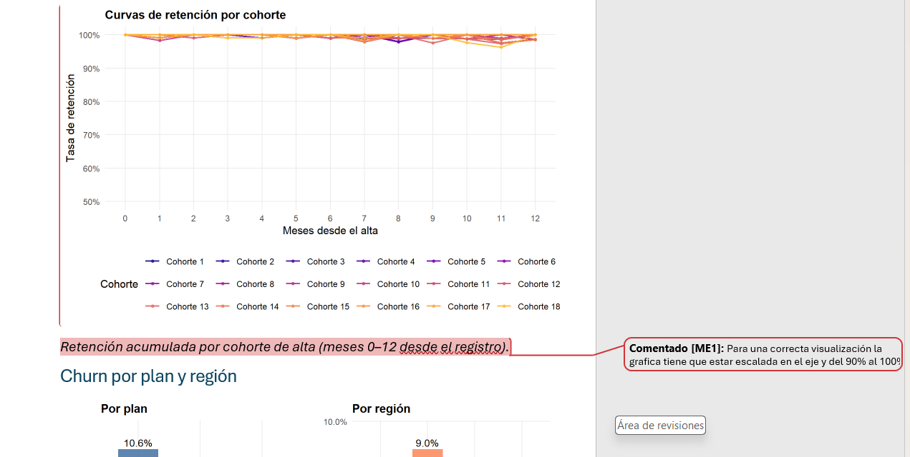
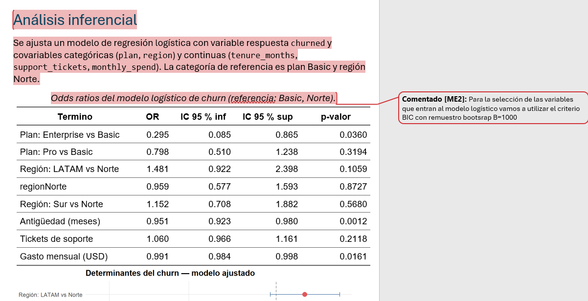
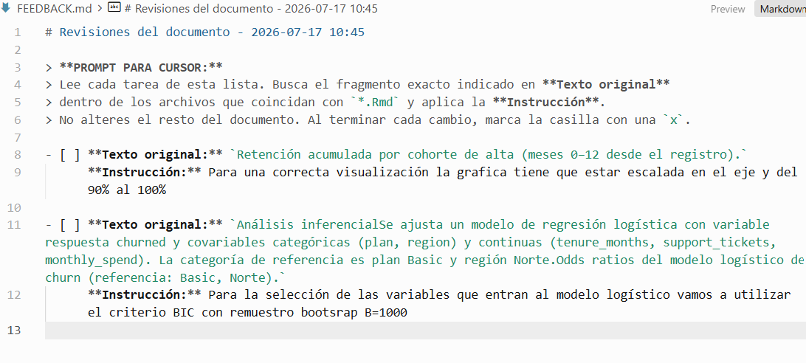
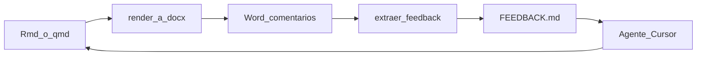

# docx2prompt

[](https://github.com/Marco-Ezquerra/docx2prompt/actions/workflows/R-CMD-check.yaml)
[](https://opensource.org/licenses/MIT)

Paquete **R** + paquete **Python** local: convierte comentarios nativos de Word (`.docx`) en un checklist Markdown listo para agentes de IA (p. ej. Cursor). Pensado para informes en **R Markdown** o **Quarto**.

## Antes, puente y despues

**Antes** — comentarios nativos en el Word (figura + modelo):

<p align="center">
  
</p>

<p align="center">
  
</p>

**Puente** — extraccion local a Markdown:

```r
docx2prompt::extraer_feedback("informe.docx")
```

```bash
docx2prompt extract informe.docx --source-glob "*.qmd"
```

**Despues** — el prompt / checklist que recibe el agente:

<p align="center">
  
</p>

## Instalacion

### R

```r
remotes::install_github("Marco-Ezquerra/docx2prompt")
```

### Python (Quarto)

```bash
pip install "git+https://github.com/Marco-Ezquerra/docx2prompt.git#subdirectory=python"
# desarrollo local:
pip install -e python/
```

**Requisitos:** R >= 4.1 y/o Python >= 3.8. Sin dependencias pip externas en el extractor.

## R Markdown y Quarto

| Flujo | Comando | `source_glob` por defecto |
|-------|---------|---------------------------|
| R Markdown | `extraer_feedback("informe.docx")` | `*.Rmd` |
| Quarto (Python) | `docx2prompt extract informe.docx` | `*.qmd` |

### R Markdown

```r
library(docx2prompt)
extraer_feedback("informe_comentado.docx")
vaciar_feedback()
```

### Quarto

```bash
quarto render informe.qmd --to docx
docx2prompt extract informe.docx --source-glob "*.qmd"
# Cursor aplica tareas sobre *.qmd
docx2prompt vaciar --source-glob "*.qmd"
```

Personaliza el glob cuando haga falta (`book/*.Rmd`, `docs/**/*.qmd`, etc.).

Ayuda: `?docx2prompt`, `?extraer_feedback`, [python/README.md](python/README.md).

## Flujo



## FAQ: privacidad y tokens

- **Extraccion 100% local.** El `.docx` se lee en tu maquina (ZIP + XML).
- **El agente no ve el Word entero.** Solo el checklist.
- **Python sin dependencias externas** en el extractor.

## Licencia

MIT (c) Marco Ezquerra Ruano
