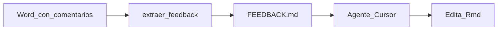

# docx2prompt

[](https://github.com/Marco-Ezquerra/docx2prompt/actions/workflows/R-CMD-check.yaml)
[](https://opensource.org/licenses/MIT)

Paquete **R** con motor **Python** local: convierte comentarios nativos de Word (`.docx`) en un checklist Markdown listo para agentes de IA (p. ej. Cursor), pensado para informes escritos en **R Markdown (`.Rmd`)**.

## Antes, puente y despues

**Antes** — comentarios nativos en el Word (figura + conclusiones):

<p align="center">
  
</p>

<p align="center">
  
</p>

**Puente** — extraccion local a Markdown:

```r
docx2prompt::extraer_feedback("informe.docx")
# → FEEDBACK.md
```

**Despues** — el prompt / checklist que recibe el agente:

<p align="center">
  
</p>

El agente busca cada **Texto original** en los `.Rmd` y aplica la **Instruccion**.

## Instalacion

```r
# install.packages("remotes")
remotes::install_github("Marco-Ezquerra/docx2prompt")
```

**Requisitos:** R >= 4.1 y Python >= 3.8 en el PATH (o `DOCX2PROMPT_PYTHON`). No hace falta ningun paquete pip: el extractor usa solo la biblioteca estandar de Python.

En desarrollo (clon del repo):

```r
devtools::load_all()
```

## Uso minimo

```r
library(docx2prompt)

extraer_feedback("informe_comentado.docx")
# → FEEDBACK.md (prompt por defecto: *.Rmd)

# Tras aplicar las correcciones con el agente:
vaciar_feedback()
```

Por defecto el prompt apunta a `*.Rmd` (cualquier R Markdown del proyecto). Si usas bookdown u otra carpeta:

```r
extraer_feedback("informe.docx", source_glob = "book/*.Rmd")
```

Ayuda en R: `?docx2prompt`, `?extraer_feedback`, `help(package = "docx2prompt")`.

## Flujo



1. Knit / exporta el informe a Word y deja **comentarios nativos**.
2. `extraer_feedback()` genera el checklist.
3. Cursor (u otro agente) aplica cada **Instruccion** sobre el texto en los `.Rmd`.
4. `vaciar_feedback()` limpia el Markdown para la siguiente iteracion.

## FAQ: privacidad y tokens

- **Extraccion 100% local.** El `.docx` se lee en tu maquina (ZIP + XML). No se envia a ninguna API ni servicio en la nube para extraer comentarios.
- **El agente no ve el Word entero.** Solo trabaja con el checklist: fragmentos senalados + instrucciones. Menos contexto = menos tokens y menos coste.
- **Menos fuga de contenido sensible.** Tablas, anexos y redaccion completa no tienen que entrar en el prompt del agente si no estan en el checklist.
- **Python sin dependencias externas.** Solo biblioteca estandar; no hay telemetria del extractor.

## Licencia

MIT (c) Marco Ezquerra Ruano
